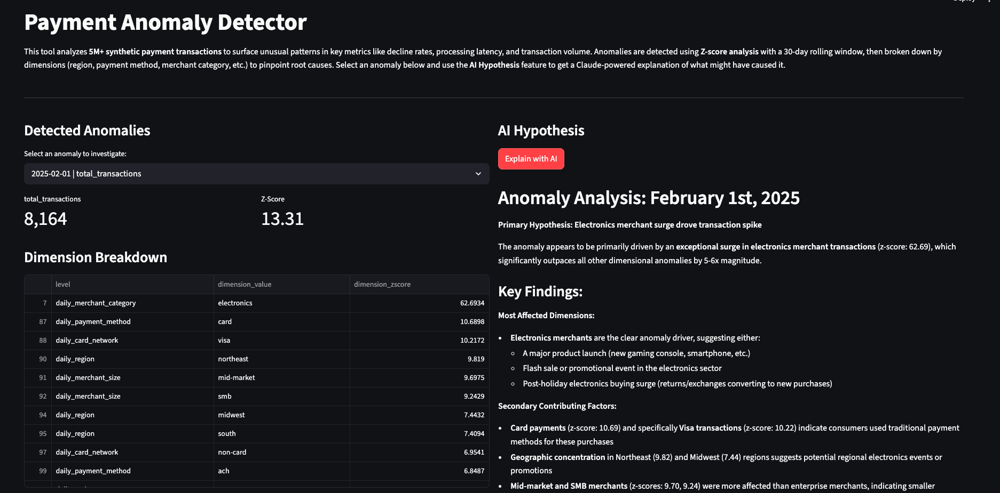
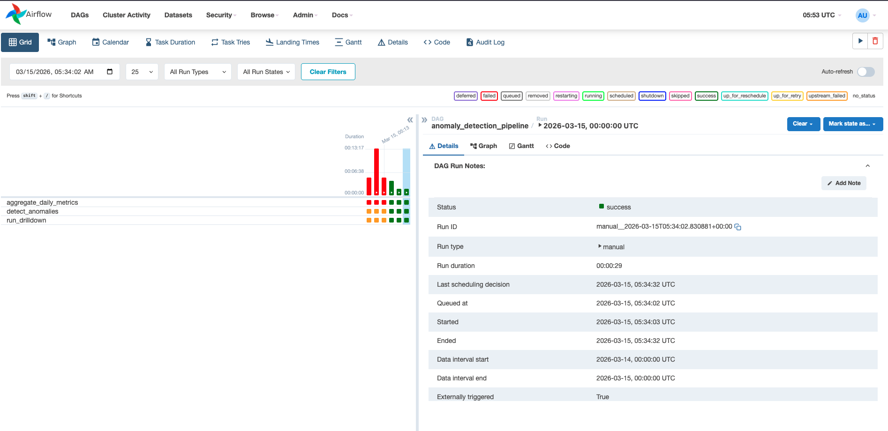
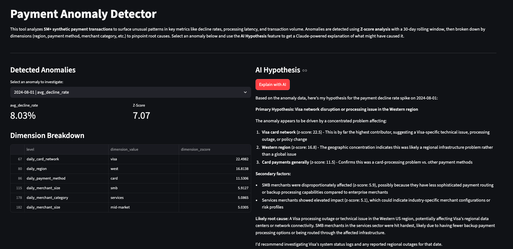

# Payment Anomaly Detector

An end-to-end data pipeline that detects anomalies in payment transaction metrics, drills down into contributing dimensions, and uses an LLM to generate human-readable explanations. Built with PySpark, Airflow, and Streamlit.

[Live Demo](https://payment-anomaly-detector-nbda46tpdfhxr9xttnxhjd.streamlit.app/)

## How It Works

1. **Data Generation** — PySpark generates ~5M synthetic payment transactions with seeded anomalies (fraud spikes, latency degradation, holiday volume surges)
2. **Aggregation** — Raw transactions are aggregated into daily metrics (transaction count, decline rate, latency, volume) grouped by region, merchant category, payment method, merchant size, and card network
3. **Anomaly Detection** — Z-score analysis with a 30-day rolling window flags metrics that deviate more than 3 standard deviations from the mean
4. **Dimension Drill-Down** — Daily-level anomalies are joined with dimension-level anomalies to identify which dimensions (e.g. a specific region or payment method) are driving the anomaly
5. **LLM Explanation** — Claude API generates a hypothesis explaining the root cause based on the dimension breakdown
6. **Dashboard** — Streamlit app lets you browse detected anomalies, view dimension breakdowns, and trigger AI-powered explanations

## Screenshots

| Streamlit Dashboard | Airflow DAG |
|---|---|
|  |  |
|  | |

## Architecture

```
Raw Transactions (5M+)
        |
   [ PySpark Aggregation ]
        |
   Daily Metrics by Dimension
        |
   [ Anomaly Detection (Z-score) ]
        |
   [ Dimension Drill-Down ]
        |
   [ Claude LLM Hypothesis Generator ]
        |
   [ Streamlit Dashboard ]
```

Orchestrated via an **Airflow DAG** that runs the aggregation, detection, and drill-down steps daily.

## Tech Stack

- **Processing**: PySpark
- **Anomaly Detection**: Z-score (30-day rolling window)
- **LLM**: Claude API (Anthropic)
- **Dashboard**: Streamlit
- **Orchestration**: Apache Airflow
- **Infrastructure**: Docker, docker-compose
- **CI/CD**: GitHub Actions

## Getting Started

```bash
# Clone the repo
git clone https://github.com/shreyeshi-somya/payment-anomaly-detector.git
cd payment-anomaly-detector

# Set up environment
cp .env.example .env  # Add your ANTHROPIC_API_KEY

# Start all services
docker-compose up --build
```

- **Streamlit Dashboard**: http://localhost:8501
- **Airflow UI**: http://localhost:8080
- **Jupyter Notebook**: http://localhost:8888

## Project Structure

```
payment-anomaly-detector/
├── docker-compose.yml
├── docker/
│   ├── Dockerfile.spark          # Spark + Jupyter container
│   └── Dockerfile.airflow        # Airflow with PySpark
├── dags/
│   └── anomaly_pipeline.py       # Airflow DAG: aggregate -> detect -> drilldown
├── src/
│   ├── data_generation/          # Synthetic transaction generator
│   ├── aggregation/              # Daily metrics aggregation
│   ├── anomaly_detection/        # Z-score anomaly detection
│   ├── drilldown/                # Dimension drill-down
│   └── llm_explainer/            # Claude API integration
├── streamlit/
│   ├── app.py                    # Dashboard application
│   ├── requirements.txt
│   └── data/                     # Pre-computed data for Streamlit Cloud
├── screenshots/                  # App screenshots
├── data/                         # Generated pipeline data (gitignored)
├── .github/
│   └── workflows/
│       └── ci.yml                # CI pipeline (pytest + linting)
└── tests/
```
